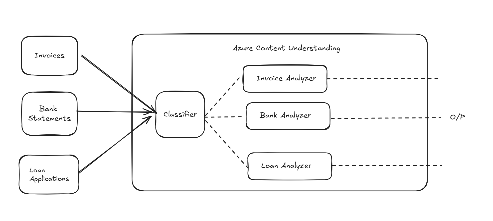
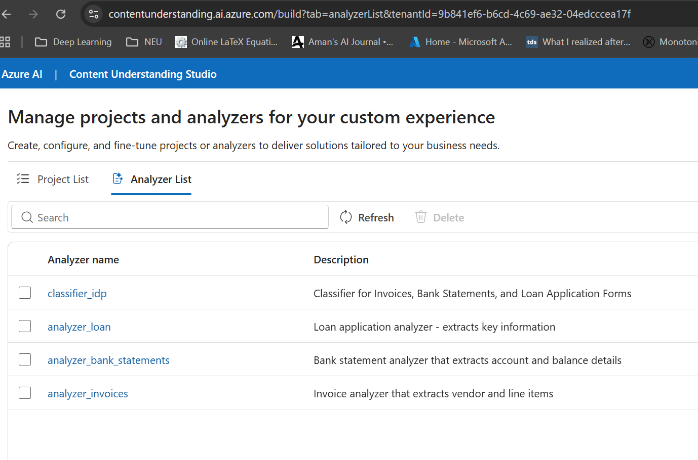

# Azure Content Understanding

This demo is built on Azure Content Understanding, which provides document classification,
field extraction, and source location metadata (bounding boxes). The app uses a custom
classifier to route documents to the correct analyzer, then renders the extracted fields
alongside the original PDF for human validation. It is designed to be a human-in-the-loop
review experience on top of Content Understanding's structured outputs.

Watch the Demo here (Click below thumbnail)
[](https://www.youtube.com/watch?v=pr0_eUm83WA)

# Intelligent Document Review App

This folder contains the Streamlit review app (`app_main.py`) and the one-time
setup script (`prereq.py`) for the Intelligent Document Processing demo.

The app workflow:
1) Upload a PDF.
2) Classify it into one of three types.
3) Route to the matching analyzer.
4) Extract fields.
5) Let a human validate and edit fields, and export the corrected data.

--------------------------------------------------------------------------------

Overall


## Business Value

This app helps business teams turn document review into a fast, reliable workflow:

- Reduce manual effort: automated classification and extraction cut repetitive data entry.
- Increase trust: every extracted value is tied to its location on the source document.
- Speed up approvals: reviewers can verify and fix fields in one screen.
- Improve consistency: standardized schemas keep outputs predictable across documents.
- Control cost: usage visibility (tokens + estimated cost) makes processing transparent.

--------------------------------------------------------------------------------

## Files

- `app_main.py`
  Streamlit UI for classification, extraction, review, editing, and CSV export.
- `prereq.py`
  Creates the classifier and three analyzers used by the app.
- `content_understanding_client.py`
  Client wrapper used by both the app and the setup script.

--------------------------------------------------------------------------------

## Prerequisites

1) Python 3.8+.
2) Azure Content Understanding resource.
3) Install required packages (typical):

   ```bash
   pip install streamlit python-dotenv azure-identity pymupdf pillow requests
   ```

4) .env configured at repo root:
   - AZURE_AI_ENDPOINT
   - AZURE_AI_API_KEY (optional if using DefaultAzureCredential)
   - CU_PRICE_PER_1K_INPUT
   - CU_PRICE_PER_1K_OUTPUT

Example:
```
AZURE_AI_ENDPOINT=https://your-resource.services.ai.azure.com/
AZURE_AI_API_KEY=...
CU_PRICE_PER_1K_INPUT=0.00275
CU_PRICE_PER_1K_OUTPUT=0.011
```

--------------------------------------------------------------------------------

## One-time Setup (prereq.py)

`prereq.py` creates:

- Classifier: classifier_idp
- Analyzer: analyzer_invoices
- Analyzer: analyzer_bank_statements
- Analyzer: analyzer_loan

Analyzers created



Run once:

```bash
python idp_app/prereq.py
```

It skips creation if these IDs already exist.

### Field Schemas

Invoices (analyzer_invoices)
```json
{
  "baseAnalyzerId": "prebuilt-document",
  "description": "Invoice analyzer that extracts vendor and line items",
  "config": {
    "returnDetails": true,
    "enableOcr": true,
    "enableLayout": true,
    "estimateFieldSourceAndConfidence": true
  },
  "fieldSchema": {
    "name": "InvoiceFields",
    "fields": {
      "VendorName": {
        "type": "string",
        "method": "extract",
        "description": "Name of the vendor or supplier, typically in the header."
      },
      "Items": {
        "type": "array",
        "method": "generate",
        "description": "List of items or services on the invoice.",
        "items": {
          "type": "object",
          "properties": {
            "Description": { "type": "string", "description": "Item description" },
            "Amount": { "type": "number", "description": "Line total amount" }
          }
        }
      },
      "InvoiceNumber": {
        "type": "string",
        "method": "extract",
        "description": "Invoice identifier (e.g., INV-100)."
      },
      "InvoiceDate": {
        "type": "string",
        "method": "extract",
        "description": "Invoice issue date."
      },
      "DueDate": {
        "type": "string",
        "method": "extract",
        "description": "Invoice due date."
      },
      "CustomerName": {
        "type": "string",
        "method": "extract",
        "description": "Customer name (top-right block)."
      },
      "ServicePeriod": {
        "type": "string",
        "method": "extract",
        "description": "Service period range (e.g., 10/14/2019 - 11/14/2019)."
      },
      "CustomerId": {
        "type": "string",
        "method": "extract",
        "description": "Customer identifier (e.g., CID-12345)."
      }
    }
  },
  "models": { "completion": "gpt-4.1-mini" },
  "tags": { "doc_type": "Invoices", "demo": "invoice" }
}
```

Bank Statements (analyzer_bank_statements)
```json
{
  "baseAnalyzerId": "prebuilt-document",
  "description": "Bank statement analyzer that extracts account and balance details",
  "config": {
    "returnDetails": true,
    "enableOcr": true,
    "enableLayout": true,
    "estimateFieldSourceAndConfidence": true
  },
  "fieldSchema": {
    "name": "BankStatementFields",
    "fields": {
      "BankName": {
        "type": "string",
        "method": "generate",
        "description": "Name of the bank issuing the statement."
      },
      "AccountHolder": {
        "type": "string",
        "method": "generate",
        "description": "Account holder name."
      },
      "AccountNumber": {
        "type": "string",
        "method": "generate",
        "description": "Account number shown on the statement."
      },
      "StatementStartDate": {
        "type": "date",
        "method": "generate",
        "description": "Statement period start date."
      },
      "StatementEndDate": {
        "type": "date",
        "method": "generate",
        "description": "Statement period end date."
      },
      "BeginningBalance": {
        "type": "number",
        "method": "generate",
        "description": "Opening balance for the period."
      },
      "EndingBalance": {
        "type": "number",
        "method": "generate",
        "description": "Closing balance for the period."
      },
      "TotalDeposits": {
        "type": "number",
        "method": "generate",
        "description": "Sum of deposits in the statement period."
      },
      "TotalWithdrawals": {
        "type": "number",
        "method": "generate",
        "description": "Sum of withdrawals in the statement period."
      }
    }
  },
  "models": { "completion": "gpt-4.1-mini" },
  "tags": { "doc_type": "Bank Statements", "demo": "bank-statement" }
}
```

Loan Application Form (analyzer_loan)
```json
{
  "baseAnalyzerId": "prebuilt-document",
  "description": "Loan application analyzer - extracts key information",
  "config": {
    "returnDetails": true,
    "enableLayout": true,
    "enableFormula": false,
    "estimateFieldSourceAndConfidence": true
  },
  "fieldSchema": {
    "fields": {
      "ApplicationDate": {
        "type": "date",
        "method": "generate",
        "description": "Date when the loan application was submitted."
      },
      "ApplicantName": {
        "type": "string",
        "method": "generate",
        "description": "Full name of the loan applicant or company."
      },
      "LoanAmountRequested": {
        "type": "number",
        "method": "generate",
        "description": "Total loan amount requested by the applicant."
      },
      "LoanPurpose": {
        "type": "string",
        "method": "generate",
        "description": "Stated purpose or reason for the loan."
      },
      "CreditScore": {
        "type": "number",
        "method": "generate",
        "description": "Credit score of the applicant, if available."
      },
      "Summary": {
        "type": "string",
        "method": "generate",
        "description": "Brief summary overview of the loan application details."
      }
    }
  },
  "models": { "completion": "gpt-4.1-mini" },
  "tags": { "doc_type": "Loan Application Form", "demo": "loan-application" }
}
```

--------------------------------------------------------------------------------

## App (app_main.py)

### Modes

1) Live (Azure)
   - Calls the Azure service to classify and extract.
   - Uses fixed IDs above.

2) Offline (saved JSON)
   - Loads a saved JSON response and PDF.
   - No Azure calls.
   - Defaults:
     - test_output/invoice_analysis_result_20260116_094953.json
     - data/invoice.pdf

### Classification and Routing

Classification is performed by calling the classifier as an analyzer:

```python
client.begin_analyze_binary(analyzer_id=classifier_idp, file_location=pdf)
```

The first category label found is used to route to the analyzer:
- `"Invoices"` -> `analyzer_invoices`
- `"Bank Statements"` -> `analyzer_bank_statements`
- `"Loan Application Form"` -> `analyzer_loan`

### Review UI

Left panel:
- Extracted fields (business-friendly view).
- Select a field to highlight its bounding boxes.
- Editable Fields: all fields shown at once in a tall scrollable editor.
  - Primitive fields: text input
  - Arrays (Items): grid editor
  - Objects/lists: JSON editor
- Download CSV button to export corrected values.

Right panel:
- Rendered PDF with bounding boxes for the selected field.
- Page navigation.

### CSV Export

The "Download CSV" button exports the edited data with columns:
- field
- value
- item_index
- item_description
- item_amount

Items arrays are expanded into multiple rows.

### Usage and Cost

If the response includes usage, the app shows:
- Model(s)
- Token counts
- Estimated cost (using CU_PRICE_PER_1K_INPUT / CU_PRICE_PER_1K_OUTPUT)

This estimate covers model tokens only (not page-based extraction meters).

--------------------------------------------------------------------------------

## Running the App

From repo root:

```bash
streamlit run idp_app/app_main.py
```

Then:
1) Choose Live or Offline mode.
2) Upload a PDF (Live) or use defaults (Offline).
3) Click Run.
4) Review, edit, and download the CSV.

--------------------------------------------------------------------------------

## Troubleshooting

### 404 Resource Not Found
- Ensure prereq.py ran successfully.
- Confirm AZURE_AI_ENDPOINT points to the correct resource.

### No fields found
- Check analyzer schema and output shape.
- Verify the document matches the analyzer.

### Bounding boxes misaligned
- Ensure page dimensions are returned in the result.
- Adjust scaling logic if needed.
